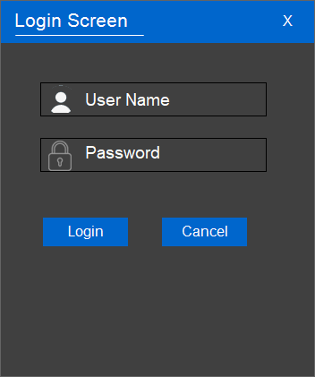
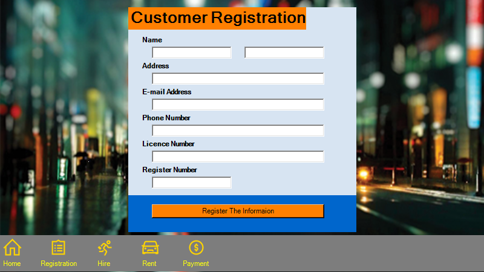
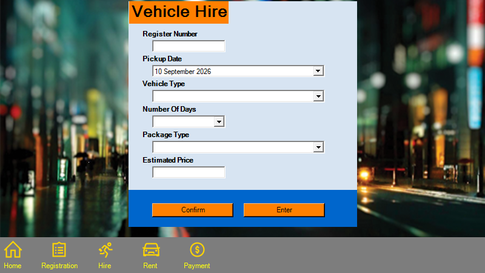
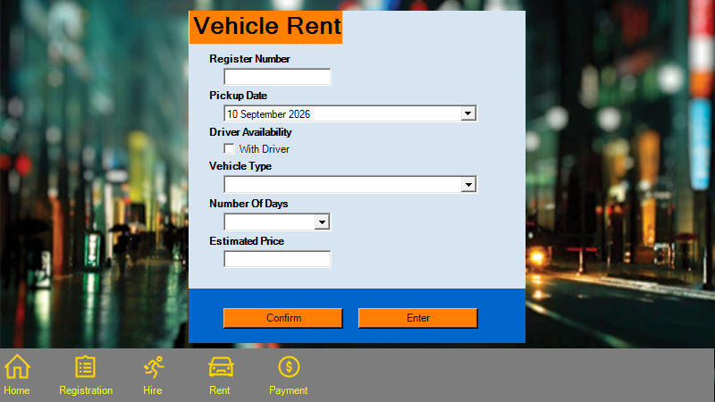
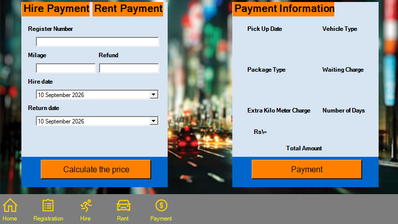
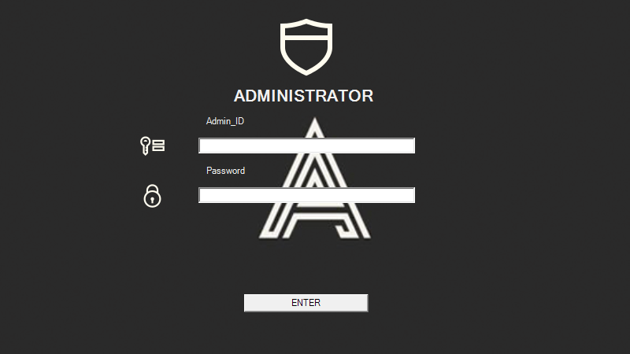

# Ayubo Life

[](https://ci.appveyor.com/project/PasinduUmayanga/Ayubo-Life)
[](https://dotnet.microsoft.com/)
[](https://learn.microsoft.com/dotnet/desktop/winforms/)

Ayubo Life is a C# Windows Forms desktop application for managing the main workflows of a vehicle rental and hire service. The application groups the operational screens for login, registration, home navigation, renting, hiring, and payment into a single .NET Framework solution.

## Why This Project Matters

Small rental businesses need a simple desktop tool to keep common service tasks organized. Ayubo Life demonstrates how a Windows Forms application can model the day-to-day flow of a rental service while keeping the code approachable for learning, maintenance, and future extension.

## Main Features

- Administrator and user entry screens.
- Customer registration workflow.
- Vehicle rent and hire forms.
- Payment screen for service transactions.
- Shared navigation helpers for moving between forms.
- Image and icon assets for the desktop UI.

## Current Business Flow

The current application flow is centered on login, customer registration, vehicle hire/rent workflows, and payment entry.

### 1. Start / Login Entry

The application opens with a taxi-themed entry screen. The user starts the system flow by selecting the login action.


### 2. User Login

The login screen captures username and password, then routes the user to the Home screen. Current code does not validate credentials.



### 3. Home

The Home screen is the main navigation hub for Registration, Hire, Rent, Payment, and Administrator access.


### 4. Customer Registration

The registration screen captures customer name, address, email, phone number, licence number, and register number.



### 5. Vehicle Hire

The hire screen captures register number, pickup date, vehicle type, number of days, package type, and estimated price.



### 6. Vehicle Rent

The rent screen captures register number, pickup date, driver availability, vehicle type, number of days, and estimated price.



### 7. Payment

The payment screen supports hire/rent payment inputs and displays payment information fields such as package, waiting charge, extra kilometer charge, number of days, and total amount.



### 8. Administrator Login

The administrator login screen provides an administrator entry point. Current code returns to Home without credential validation.



### Flow Summary

```text
Start -> User Login -> Home
                      |-> Customer Registration
                      |-> Vehicle Hire
                      |-> Vehicle Rent
                      |-> Payment
                      |-> Administrator Login -> Home
```

The current project mainly implements the screen layout and navigation flow. Data persistence, credential validation, rent/hire confirmation logic, price calculation, and payment processing are not implemented yet.

## Technology Stack

- C#
- Windows Forms
- .NET Framework 4.7.2
- Visual Studio solution and MSBuild project files
- AppVeyor continuous integration

## Important Code Areas

- `Ayubo Life.sln` - Visual Studio solution entry point.
- `Ayubo Life/Program.cs` - application startup.
- `Ayubo Life/Home.cs` - main navigation screen behavior.
- `Ayubo Life/Registration.cs` - customer registration form.
- `Ayubo Life/Rent.cs` - rent workflow form.
- `Ayubo Life/Hire.cs` - hire workflow form.
- `Ayubo Life/Paymnet.cs` - payment workflow form.
- `Ayubo Life/Navigation.cs` - shared navigation logic.

## Build

Open `Ayubo Life.sln` in Visual Studio 2022 or newer and build the solution with the `Release` configuration.

From a Developer PowerShell prompt:

```powershell
nuget restore "Ayubo Life.sln"
msbuild "Ayubo Life.sln" /p:Configuration=Release /p:Platform="Any CPU" /m
```

The AppVeyor pipeline in `appveyor.yml` restores NuGet packages, caches NuGet package folders, runs a NuGet vulnerability check for PackageReference projects, builds the solution, and publishes the Release output as a build artifact.

## Dependency And Vulnerability Notes

This project currently does not use `PackageReference` or `packages.config` NuGet dependencies, so there are no NuGet packages for the standard `dotnet list package --vulnerable --include-transitive` audit to inspect. The only non-framework assembly reference is `Microsoft.VisualBasic.PowerPacks.dll`, which is included in the repository and referenced by the Windows Forms designer code.

When NuGet dependencies are added later, prefer `PackageReference` so AppVeyor can audit direct and transitive package vulnerabilities during the build.

## Repository Structure

```text
Ayubo Life/      Windows Forms source code, resources, and project file
Images/          UI images and icons used by the application
appveyor.yml     AppVeyor CI build configuration
README.md        Project overview and build notes
```
